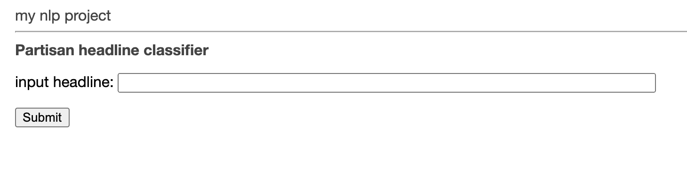

# Getting Started

This document aims to help you to familiarize yourself with the project starter code so you can adapt it to your project.

You should have been assigned a project repository for your work. In the examples below, we'll assume the repository is called <https://github.com/tulane-cmps6730/sample-project>. This is where all your code will live. 

## Installation

Your repository has been setup with a lot of starter code so you can up and running quickly. To use it, do the following:

1. Make sure you've completed all the course **Background Resources** listed on the [README](https://github.com/tulane-cmps6730/sample-project/blob/main/README.md).
2. Clone your repo:  `git clone https://github.com/nlp/sample-project` [use your project's repository name]
3. Start a [virtual environment](https://virtualenv.pypa.io/en/stable/).
  - First, make sure you have virtual env installed. `pip install virtualenv`
  - Next, outside of the team repository, create a new virtual environment folder by `virtualenv nlp-virtual`. 
  - Activate your virtual environment by `source nlp-virtual/bin/activate`
  - Now, when you install python software, it will be saved in your `nlp-virtual` folder, so it won't conflict with the rest of your system.
4. Install your project code by
```
cd sample-project   # enter your project repository folder
pip install -r requirements.txt
python setup.py develop # install the code. 
```

This may take a while, as all dependencies listed in the `requirements.txt` file will also be installed. By using the `develop` command (instead of `install`), any changes you make to your code will automatically be reflected without having to reinstall anything.

**Windows users**: if you're having troubles, try reading [this](http://timmyreilly.azurewebsites.net/python-flask-windows-development-environment-setup/). It looks like you will need to:
- install `pip install virtualenvwrapper-win`
- instead of `virtualenv nlp-virtual` above, do `mkvirtualenv nlp-virtual`
- other students have also had luck starting environments with the command `py -3 -m venv env env\scripts\activate`

5. If everything worked properly, you should now be able to run your project's command-line tool by typing:  
```
nlp --help
```
which should print
```
Usage: nlp [OPTIONS] COMMAND [ARGS]...

  Console script for nlp.

Options:
  --help  Show this message and exit.

Commands:
  dl-data  Download training/testing data.
  stats    Read the data files and print interesting statistics.
  train    Train a classifier and save it.
  web      Launch the flask web app
```

## Running the sample project

The sample project trains a very simple classifier to predict if a news headline comes from a liberal or conservative news source. Your project should be much more involved and interesting! This example is just to demonstrate the key steps required in the project. To run it:

1. `nlp dl-data`: This downloads the training data from Dropbox and saves it to `~/.nlp/headlines.csv`. The file looks like this:
```
partisan,title
1,"Democrats Still Can’t Accept Results Of The 2016 Election, Says John Davidson"
0,How Conservative Media Outlets Are Covering Trump’s Impeachment
1,Donald Trump at March for Life: ‘Every Child Is a Sacred Gift from God'
```
Here, `partisan` is the class label (1: conservative, 0: liberal), and `title` is the headline. 

2. `nlp stats`: This computes some simple stats over the data
```
48187 rows
label counts:
1    27660
0    20527
Name: partisan, dtype: int64
```

3. `nlp train`: This trains a classifier, reports cross-validation accuracy, and saves the classifier to `~/.nlp/clf.pkl`

```
              precision    recall  f1-score   support

           0       0.67      0.72      0.70     20527
           1       0.78      0.74      0.76     27660

    accuracy                           0.73     48187
   macro avg       0.73      0.73      0.73     48187
weighted avg       0.74      0.73      0.73     48187

top coef for conservative
               nolte  3.47
             shapiro  3.07
              pollak  3.01
                8217  2.94
           flashback  2.80
  illegal immigrants  2.67
              klavan  2.54
                curl  2.37
          fact check  2.30
                 fnc  2.30


top coef for liberal
           explained  -4.04
           headlines  -2.04
                 x27  -2.02
             staying  -1.99
              savior  -1.95
       controversial  -1.92
        biden denies  -1.88
  conservative media  -1.88
         schiff says  -1.87
           announced  -1.82
```

4. `nlp web`: This launches a Flask web server to demo the classifier. 

```
read clf LogisticRegression(C=1, class_weight='balanced', max_iter=1000)
read vec CountVectorizer(binary=True, min_df=5, ngram_range=(1, 3), stop_words='english')
 * Serving Flask app "nlp.app" (lazy loading)
 * Environment: production
   WARNING: This is a development server. Do not use it in a production deployment.
   Use a production WSGI server instead.
 * Debug mode: on
 * Running on http://0.0.0.0:5000/ (Press CTRL+C to quit)
 * Restarting with stat
read clf LogisticRegression(C=1, class_weight='balanced', max_iter=1000)
read vec CountVectorizer(binary=True, min_df=5, ngram_range=(1, 3), stop_words='english')
 * Debugger is active!
 * Debugger PIN: 128-371-422
```

If you open your web browser and go to `http://0.0.0.0:5000/` you should see something like:




**Tips:**
- Some web browsers will cache the page, which will sometimes make it hard to see the updates you make. You may have to force a refresh that ignores the cache (e.g. see [here for Chrome](https://superuser.com/questions/89809/how-to-force-refresh-without-cache-in-google-chrome)).
